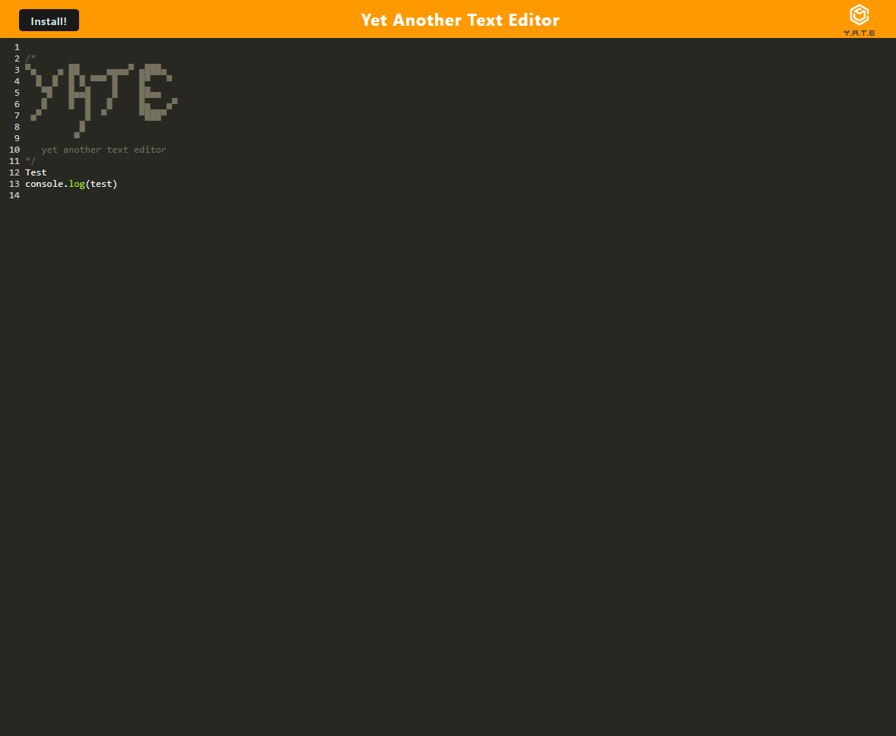
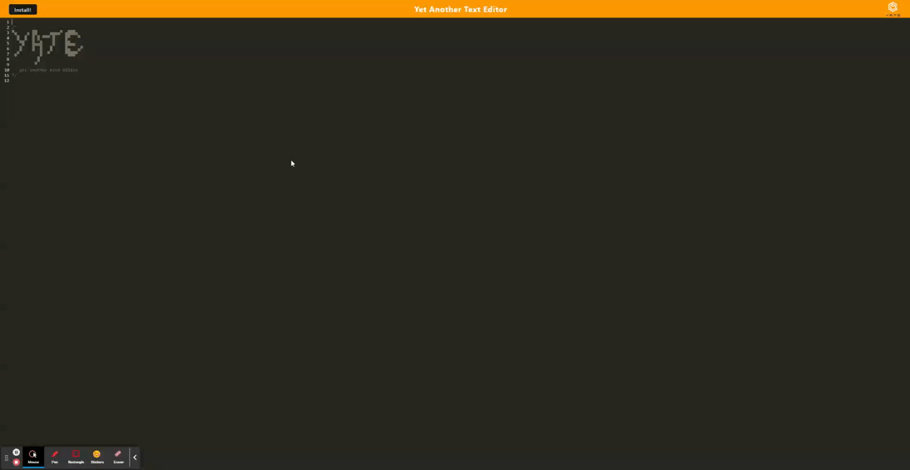
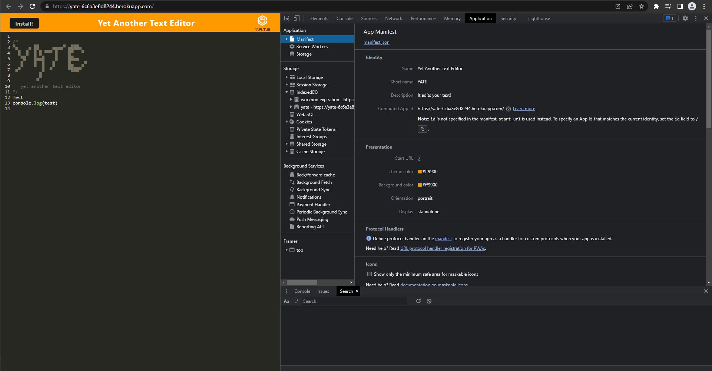
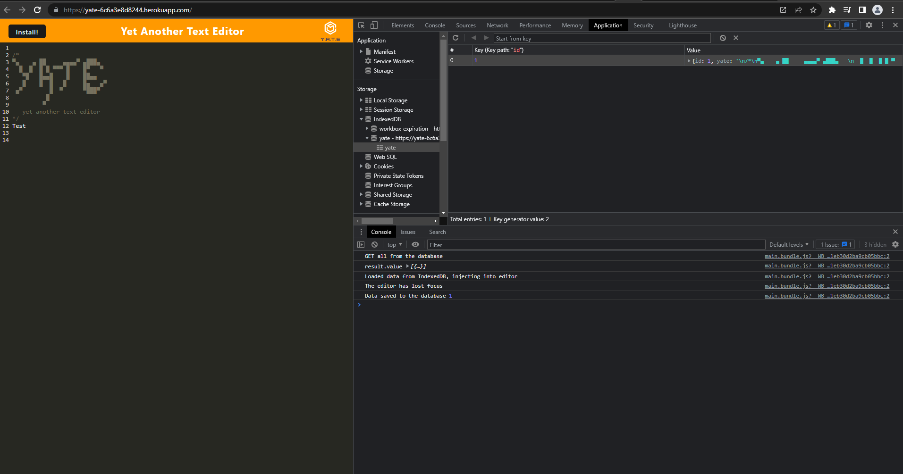

# Yet Another Text Editor

## Description

Yet Another Text Editor (YATE) is a Progressive Web Application that can run and store data online or offline.

## Installation

  Clone the repository:

    git clone git@github.com:iqwixn/yet-another-text-editor.git
    

   Open in a new gitbash terminal from the root directory and run the command:

  
    npm install && npm run start
 

Open in local host:

    http://localhost:3000/
    

## Install locally:

Click on this link:

    https://yate-6c6a3e8d8244.herokuapp.com/

Click on the Install! button in the top left corner

## Questions
If you have any questions, please reach out to me at:

    github: https://github.com/iqwixn

    email: aleksey.nizhnikov@gmail.com

## Website Link

https://yate-6c6a3e8d8244.herokuapp.com/

## Screenshots

